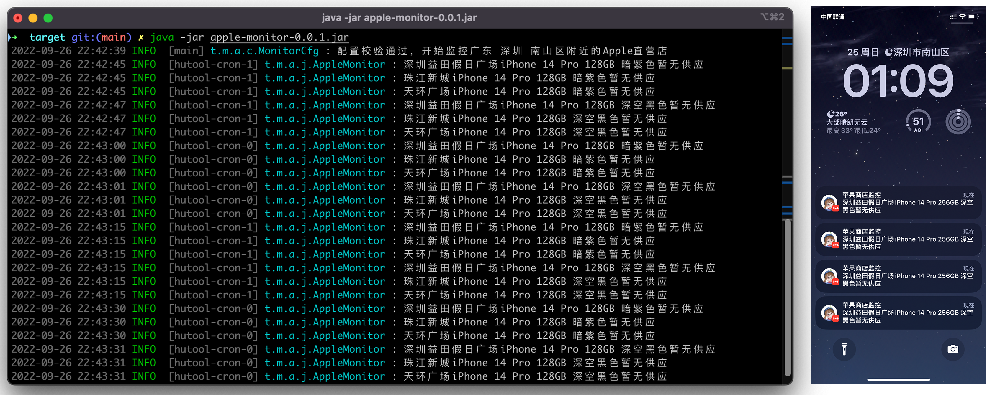

<div align="center">
<h1 align="center">AppleMonitor</h1>

[](https://github.com/MoshiCoCo/Apple-Monitor/stargazers)
[](https://github.com/MoshiCoCo/Apple-Monitor/network)
[](https://github.com/MoshiCoCo/Apple-Monitor/issues)
[](https://github.com/MoshiCoCo/Apple-Monitor/blob/main/LICENSE)
[](https://github.com/MoshiCoCo/Apple-Monitor/releases)
[](https://github.com/MoshiCoCo/Apple-Monitor/releases)
[](https://hits.seeyoufarm.com)
</div>

- [AppleMonitor](#applemonitor)
- [使用效果](#使用效果)
- [如何使用](#如何使用)
- [支持的推送方式](#支持的推送方式)
- [常见问题](#常见问题)
- [关注我](#关注我)
- [致谢](#致谢)
- [License](#license)
- [Stargazers over time](#stargazers-over-time)

## iPhone 17 系列工作正常

## AppleMonitor

一个用 Java 实现的 Apple 线下商店库存监控工具,支持Bark,飞书，Lark机器人等消息推送方式。

目前已经支持监控中国大陆，中国香港，中国澳门，中国台湾，日本，韩国，新加坡，马来西亚，澳大利亚，英国，加拿大，美国等地区的苹果商店。

CN, CN_HK, CN_MO, CN_TW, JP, KR, SG, MY, AU, UK, CA, US
Currently, it supports monitoring Apple Stores in mainland China, Hong Kong, Macau, China Taiwan, Japan, Korea,
Singapore, Malaysia, Australia, United Kingdom, Canada, United States and other
regions.

## 支持国家

|  国家  | Country Code | 支持情况 |
|:----:|:------------:|:----:|
| 中国大陆 |      CN      |  ✅   |
| 中国香港 |    CN_HK     |  ✅   |
| 中国澳门 |    CN_MO     |  ✅   |
| 中国台湾 |    CN_TW     |  ✅   |
|  日本  |      JP      |  ✅   |
|  韩国  |      KR      |  ✅   |
| 新加坡  |      SG      |  ✅   |
| 马来西亚 |      MY      |  ✅   |
| 澳大利亚 |      AU      |  ✅   |
|  英国  |      UK      |  ✅   |
| 加拿大  |      CA      |  ✅   |
|  美国  |      US      |  ✅   |

## 使用效果



## 如何使用

1. 下载构建的产物压缩包 [releases版本](https://github.com/MoshiCoCo/Apple-Monitor/releases)
2. 解压压缩包，文件内会包含一个可执行的jar和一份config.json配置文件，以及说明文档若干。
3. 编辑config.json配置你需要监控的产品型号以及地区即可，可支持cron表达式自定义监控频率。
4. 执行命令 `java -jar apple-monitor-v*.jar`

**配置文件参数解释**

| 值                 | 含义                                                                                  |
|-------------------|-------------------------------------------------------------------------------------|
| cronExpressions   | 执行的cron表达式,建议执行时间间隔设置为 （监控的设备型号数*3）秒，如果你不会写corn表达式，建议使用程序输出的推荐表达式                   |
| country           | Supported: CN, CN-HK, CN-MO, CN-TW, JP, KR, SG, MY, AU, UK, CA, US                  |
| location          | 你所在的区域，要用苹果官网风格的地址，例如 广东 深圳 南山区 或者 重庆 重庆 XX区（其他地区请用邮政编码）                            |
| deviceCodeList    | Object List                                                                         |
| deviceCode        | 需要监控的产品代码   [产品型号代码可参考 the apple wiki](https://theapplewiki.com/wiki/Models#iPhone) |
| storeWhiteList    | 商店白名单，一个区域可能有多个商店，仅监控白名单中的商店，模糊匹配，不填则默认监控所有                                         |
| pushConfigs       | Object List   推送配置                                                                  |
| barkPushUrl       | bark推送服务器地址,默认为  https://api.day.app/push                                           |
| barkPushToken     | bark token    [获取BarkToken请参考](./docs/use-bark.md)                                  |
| barkPushSound     | bark 推送铃声                                                                           |
| feishuBotWebhooks | 飞书机器人webhook地址                                                                      |
| feishuBotSecret   | 飞书机器人secret                                                                         |

**配置文件示例**

```json
{
  "appleTaskConfig": {
    "cronExpressions": "*/12 * * * * ?",
    "country": "CN",
    "location": "广东 深圳 南山区",
    "deviceCodeList": [
      {
        "deviceCode": "MTQA3CH/A",
        "storeWhiteList": [
          "益田假日"
        ],
        "pushConfigs": [
          {
            "barkPushUrl": "https://api.day.app/push",
            "barkPushToken": "你的token",
            "barkPushSound": "multiwayinvitation.caf",
            "feishuBotWebhooks": "",
            "feishuBotSecret": ""
          }
        ]
      },
      {
        "deviceCode": "MTQC3CH/A",
        "storeWhiteList": [
          "益田假日"
        ],
        "pushConfigs": [
          {
            "barkPushUrl": "",
            "barkPushToken": "",
            "feishuBotWebhooks": "",
            "feishuBotSecret": ""
          }
        ]
      }
    ]
  }
}
```

注🇯🇵：
如果需要监控日本地区的情况，请将country设置为JP，
location设置为你所在的区域邮编，例如：197-0804，deviceCodes设置为你需要监控的产品型号（日本版本型号），storeWhiteList设置为你需要监控的商店，例如
新宿 ，不填则默认监控所有。

日本地域プロファイル参照例 [config-jp.json](./src/main/resources/config-jp.json)

注🇰🇷：
如果需要监控韩国地区的情况，请将country设置为KR，
location设置为你所在的区域邮编，例如：01000，deviceCodes设置为你需要监控的产品型号（韩国版本型号），storeWhiteList设置为你需要监控的商店，例如
여의도 ，不填则默认监控所有。

韩国地区设置参考[config-kr.json](./src/main/resources/config-kr.json)

*如何使用Bark请参考 [Bark使用文档](./docs/use-bark.md)*

*苹果产品型号代码请参考 [产品型号列表](./docs/apple-device-codes.md)*

## 支持的推送方式

- feishu bot
- bark

## 常见问题

- 如果使用 Windows 系统的CMD执行出现乱码，执行前先执行 `chcp 65001` 这条命令。

## 关注我


## 免责

1. 本项目仅用于学习研究，禁止任何人用于商业及非法用途，如产生法律纠纷与本人无关。
2. 本项目为开源项目，若相关公司有异议，请邮件联系作者，作者收到邮件后会及时处理。

## 致谢

**感谢 [@realJustinLee](https://github.com/realJustinLee) 同学对其他国家地区适配所作出的出色工作。**

**Thanks to [@realJustinLee](https://github.com/realJustinLee) for his excellent work in adapting to other countries and
regions.**

**感谢 JetBrains 对本项目的支持。**

**Thanks to JetBrains for supporting this project.**

[](https://www.jetbrains.com/?from=Apple-Monitor)

## License

## Stargazers over time

[](https://starchart.cc/MoshiCoCo/Apple-Monitor)
