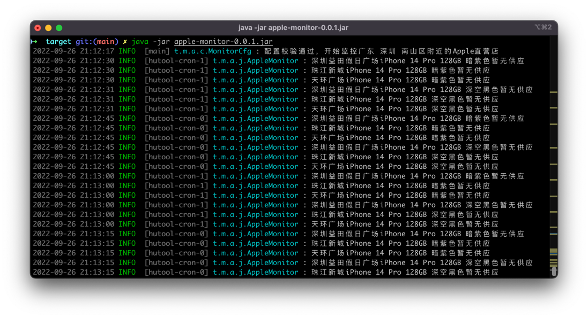
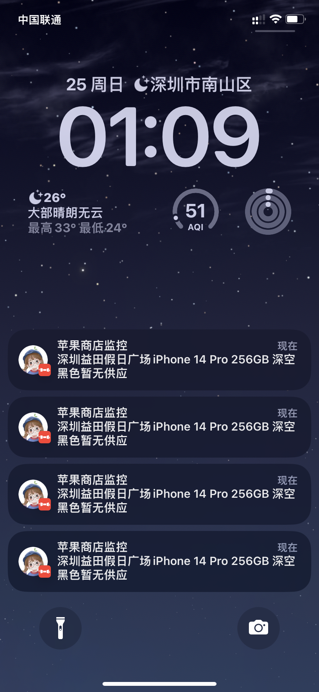

## AppleMonitor

一个用 Java 实现的 Apple 线下商店库存监控工具,支持bark,dingtalk，企业微信等监控方式。

## 使用效果





## 如何使用

下载jar包，编辑config.json配置你需要监控的产品型号以及地区即可。 可支持cron表达式自定义监控频率。

配置文件参数示例

```json
{
  "cronExpressions": "*/10 * * * * ?",
  "barkPushToken": "",
  "barkPushUrl": "https://bark.xxx.com/push",
  "deviceCodes": [
    "MQ0D3CH/A"
  ],
  "location": "广东 深圳 南山区",
  "storeWhiteList": [
    "益田假日",
    "珠江新城",
    "天环广场"
  ]
}
```

## 支持的推送方式

- 钉钉
- bark
- 企业微信
- server酱