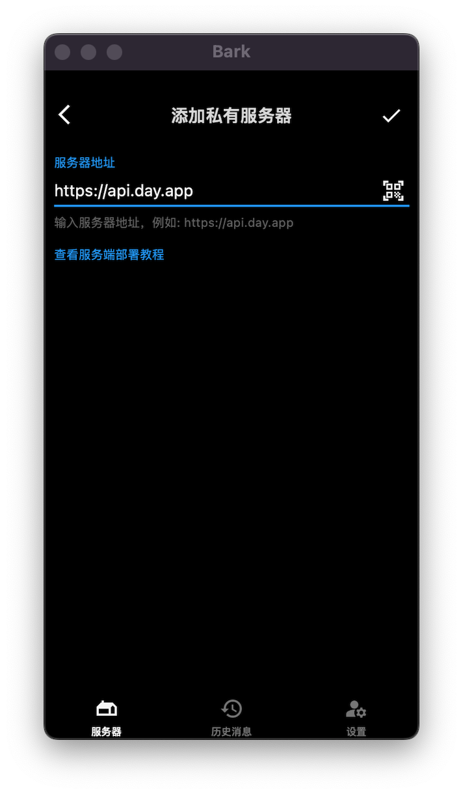

## 下载bark客户端

苹果可直接在App Store中下载,[App Store下载地址](https://apps.apple.com/cn/app/bark-customed-notifications/id1403753865)

安卓请自行在各大应用市场下载。

## 配置bark推送App

1. 打开bark，点击底部服务器栏，点击右上角的“+”号，添加一个新的推送服务。
2. 输入bark官方的推送地址：`https://api.day.app`，点击右上角的确定按钮。
   
3. 点击刚刚添加的推送服务，测试下是否能够收到通知。
4. 如果能够收到通知，点击第一个推送URL的复制按钮，得到类似于 `https://api.day.app/xqk********nbf/这里改成你自己的推送内容`
   这样的地址 ，其中`xqk********nbf`就是推送的token。

## 私有化的Bark推送服务（可选）

https://api.day.app
是Bark作者提供的一个公共推送服务，如果你想自己私有化部署bark推送服务端，请参考bark作者的[部署文档](https://day.app/2018/06/bark-server-document/)
